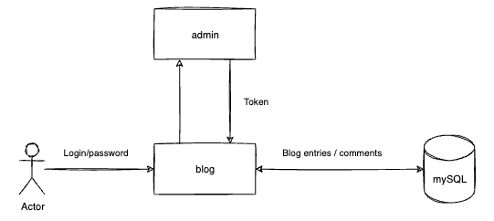

# Title

This decision defines the application is a blog rest API for CHECK24.

## Status

Draft

## Date

2023-11-08

## Context

The application is a blog rest API.

Please note the following:

- Only the Go standard libs may be used
- No MVC frameworks are permitted
- Dependencies can be drawn via packet management soIware
- The total scope of the application deliberately exceeds the available 5me
- Quality is more important to us than quantity

## Decision

We use several microservices

- Blog - for working with blog entries and comments
- Admin - authorization & authentication and get tokens

 

**Consequences**

Positive:

- we share the implementation of different parts of the system between services and can independently change the implementation.    

Negative:

- we have to support several services instead of one monolith application.
- We transfer the complexity of interaction between parts of the system to network interactions.

## Compliance

The simplicity and independence of the implementation of individual parts of the system outweigh the complexity of network interaction.    

## Notes

- Author: Victor Kyarginskiy
    
- Version: 1.0
    
- Changelog:
    
    - 1.0: Initial proposed version
